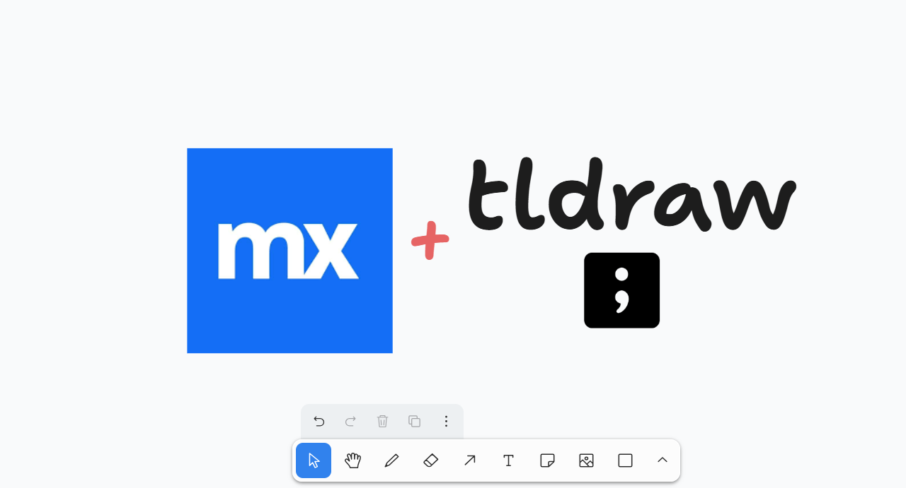
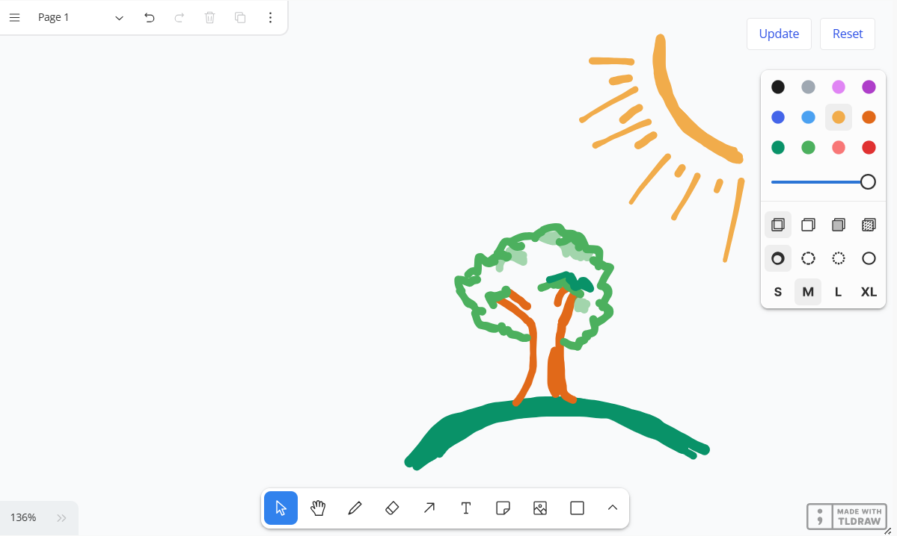

# InteractiveWhiteboardWidget - Version 1.0

  
  

A Mendix widget which uses the tldraw whiteboard to provide an interactive whiteboard.

## Features
- Store the JSON data of your whiteboard in a Mendix object, allowing you to keep a presistable version of your creations
- Read only mode to display your creations to users without allowing them to edit your creation
- Dark and light modes for the whiteboard
- Regular bootstrap styling (info, danger, ...) to match familiar styling within Mendix
- Manual and automatic saving of your whiteboard so you can control when to save JSON data

### Important notes
When updating the string attribute holding your JSON data (controlled on the "Events" section and "On Change" option in the widget settings), the widget will rerender the whiteboard, causing your toolbar selection and undo features to reset. Take this into careful consideration when selecting auto update of whiteboard changes.
Saving the whiteboard causes the Mendix object to refresh, causing the toolbar selections to reset. This has partially been resolved with the "Persist toolbar" option when using auto on updates to the whiteboard.
